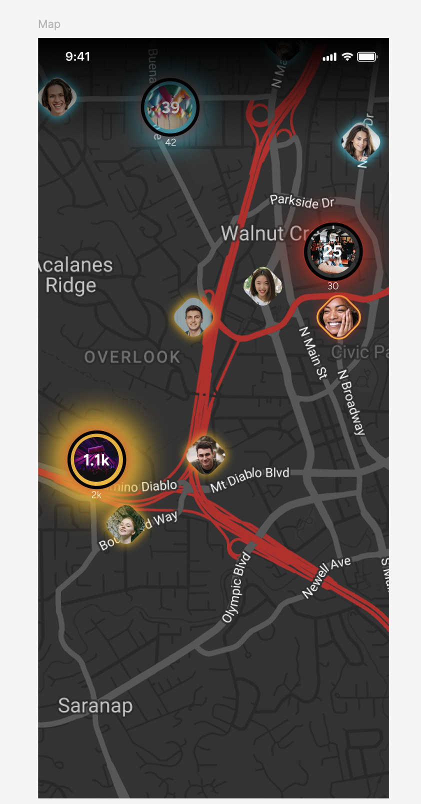
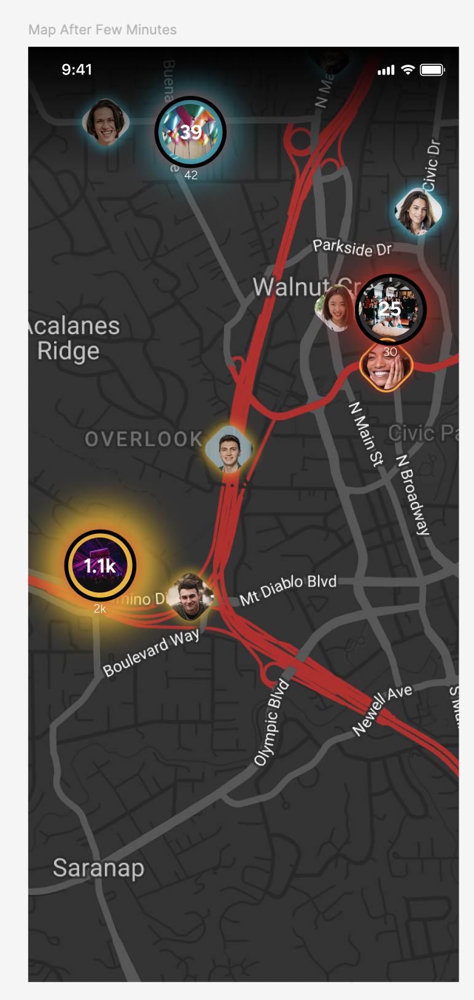

# Pokemon Go Style Venue Finder

-   [Pokemon Go Style Venue Finder](#pokemon-go-style-venue-finder)
    -   [Overview](#overview)
    -   [Project Description](#project-description)
    -   [Screens and Requirements](#screens-and-requirements)
        -   [Screen 1: Initial Map View](#screen-1-initial-map-view)
            -   [Requirements:](#requirements)
        -   [Screen 2: House/Event Details](#screen-2-houseevent-details)
            -   [Requirements:](#requirements-1)
    -   [Technical Details](#technical-details)
    -   [Submission Details](#submission-details)

## Overview

We are creating an innovative application where users can explore and discover special "Pokemon Go" houses/Events in a fictional world. Users need to find houses with the highest concentration of Pokemons. Our goal is to implement this design and functionality using a React Native project with Expo and Google Map.

## Project Description

1. **Map Component**:

    - We will use styled Google Map maps to display our target houses.
    - The map component will have two main elements: users and house (represented as Pokemon Go houses).

2. **Users**:

    - Users are the interactive elements on the map, representing Pokemon hunters.
    - Users attend different houses, represented as Pokemon gatherings at various houses.
    - In their default state, users have no shadow color. However, if a user is attending an event that is happening or about to happen in a few hours, their pin will display a shadow matching the event’s shadow color.
    - By tapping on a user's pin, the app navigates to the user's profile page (no need to implement the navigation part, just make sure the user info will display by simple alert box after click the user's pin).

3. **Events (Pokemon Go Houses)**:

    - Events are static elements on the map, represented as houses with number of Pokemon.
    - Each event has a unique randomized color representing different Pokemon types.
    - Event shadow size correlates with the event's current attendance (number of Pokemon found). The largest event on the screen has the biggest shadow, with other events proportionally smaller.
    - The "Users Count Presented" parameter includes all users (Pokemon hunters) in the vicinity of the event. Users close to an event will be removed from the map, and the event number will update with an animation.

4. **Shadow and Border Styles**:

    - There will be three different kinds of shadows and border styles for users, determined by backend response `shadow_color`. These styles will reflect the rarity and strength of the Pokemon they are hunting `pokemon_present`.

## Screens and Requirements

### Screen 1: Initial Map View

#### Requirements:

1. **Map Display**:

    - Integrate Google Map with React Native and Expo(Expo Go 51).
    - Display a styled map `mapStyle.js` with user and event (house) markers.
    - Events/Houses should be in a different layer than Users layer. And Event/ Houses always need to be drawn above users layer

1. **User Markers**:
    - Display user markers on the map with live coordinates.
    - Users should have no shadow in their default state.
1. **Event Markers**:
    - Display event markers (houses) with unique randomized colors.
    - Event shadow size should correlate with the event's current attendance.
1. **Interaction**:
    - Tapping on a event's pin navigates to the House/Event detail screen (see below).
    - Tapping on a user's pin navigates to the user info page.

### Screen 2: House/Event Details

> Please note that all interactions should occur on a single screen with layers on top of the map. When a user clicks on an event marker, the event details and user avatars should be displayed directly on the map, as shown in the design.

**Important Points to Remember:**

-   **Event Markers Layer**: Event markers should always be displayed above user markers. This means that if there are many users at the same location as a Pokémon house/event, the event marker must remain on top.
-   **Event Details Display:** Clicking on an event marker should hide all the points and events on the map and zoom into events coordination and display the event's details and user avatars directly on the map, not in a modal. Ensure this matches the design exactly.

#### Requirements:

1. **Event Information**:

    - Display detailed event/house information when an event marker is tapped.
    - Include event name, and the number of attendees.
    - Display up to 6 users's avatar attending attending to that house.

2. **Shadow and Attendance**:
    - Event markers should dynamically update shadow size based on the number of attendees.
    - Ensure the "Users Count Presented" parameter updates as users move closer to the event.

## Technical Details

-   **Framework**: React Native with Expo and Expo Go 51
-   **Mapping Library**: Google Map
-   **Components**:
    -   Users: Interactive elements with live coordinates and event-specific shadows.
    -   Events: Static elements with unique colors and shadow sizes based on attendance.

## Submission Details

Please raise your PR according the following checklist and update this checklist in your PR description:

-   [x] I followed the above information and implemented the required screens and functionalities.
-   [x] All Design is 100% matched with the provided images.
-   [x] I tested different scenarios to ensure the app functions correctly.
-   [x] I have implemented the shadow and border styles for users based on the backend response.
-   [x] I have implemented the users, and event's layers correctly.

Thank you for contributing to our project. Your work is crucial in bringing this innovative application to life. If you have any questions or need further clarification, feel free to reach out. Please email the [mohsensalemzadeh@gmail.com](mohsensalemzadeh@gmail.com) and let me know you have finished this task.

Thanks
Mohsen
