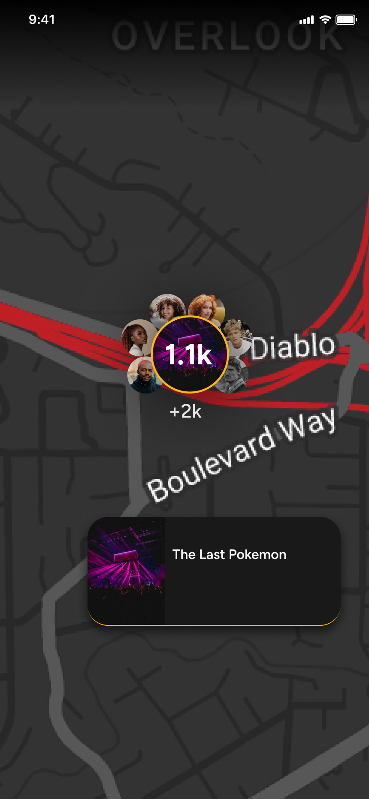

# Pokemon Go Style Venue Finder

## Overview

We are creating an innovative application where users can explore and discover special "Pokemon Go" houses/Events in a fictional world. Users need to find houses with the highest concentration of Pokemons. Our goal is to implement this design and functionality using a React Native project with Expo and Google Map or Mapbox.

## Project Details

1. **Map Component**:

    - We will use styled Google Map or MapBox maps to display our target houses.
    - The map component will have two main elements: users and house (represented as Pokemon Go houses).

2. **Users**:

    - Users are the interactive elements on the map, representing Pokemon hunters.
    - Users attend different houses, represented as Pokemon gatherings at various houses.
    - In their default state, users have no shadow color. However, if a user is attending an event that is happening or about to happen in a few hours, their pin will display a shadow matching the event’s shadow color.
    - By tapping on a user's pin, the app navigates to the user's profile page (no need to implement the navigation part, just make sure the user info will display by simple alert box after click the user's pin).

3. **Events (Pokemon Go Houses)**:

    - Events are static elements on the map, represented as houses with number of Pokemon.
    - Each event has a unique randomized color representing different Pokemon types.
    - Event shadow size correlates with the event's current attendance (number of Pokemon found). The largest event on the screen has the biggest shadow, with other events proportionally smaller.
    - The "Users Count Presented" parameter includes all users (Pokemon hunters) in the vicinity of the event. Users close to an event will be removed from the map, and the event number will update with an animation.

4. **Shadow and Border Styles**:

    - There will be three different kinds of shadows and border styles for users, determined by backend response `shadow_color`. These styles will reflect the rarity and strength of the Pokemon they are hunting `pokemon_present`.

## Screens and Requirements

### Screen 1: Initial Map View


#### Requirements:

1. **Map Display**:
    - Integrate Google Map or MapBox with React Native and Expo(Expo Go 51).
    - Display a styled map (`mapStyles.js`) with user and event (house) markers.
2. **User Markers**:
    - Display user markers on the map with live coordinates.
    - Users should have no shadow in their default state.
3. **Event Markers**:
    - Display event markers (houses) with unique randomized colors.
    - Event shadow size should correlate with the event's current attendance.
4. **Interaction**:
    - Tapping on a event's pin navigates to the events info page.

### Screen 2: Map After Few Minutes



### Screen 3: House/Event Details


#### Requirements:

1. **Event Information**:
    - Display detailed event/house information when an event marker is tapped.
    - Include event name, date, time, remaining time, and the number of attendees.
    - Display up to 6 users avatar attending attending to that house.
2. **Shadow and Attendance**:
    - Event markers should dynamically update shadow size based on the number of attendees.
    - Ensure the "Users Count Presented" parameter updates as users move closer to the event.

## Technical Details

-   **Framework**: React Native with Expo (version 5.80)
-   **Mapping Library**: MapBox
-   **Components**:
    -   Users: Interactive elements with live coordinates and event-specific shadows.
    -   Events: Static elements with unique colors and shadow sizes based on attendance.

## Instructions for Freelancers

1. **Clone the Repository**:

    ```sh
    git clone https://github.com/JeffShomali/pokeman-person
    cd pokeman-person
    ```

2. **Install Dependencies**:

    ```sh
    npm install
    ```

3. **Run the Project**:

    ```sh
    npm start
    ```

4. **Implement the Requirements**:

    - Follow the notes provided for each screen to implement the required features.
    - Ensure that live updates and dynamic styles are correctly implemented as per the project requirements.

5. **Testing**:

    - Thoroughly test the app for all features and ensure that all functionalities work as expected.
    - Report any issues or suggestions for improvement.

6. **Submit Your Work**:
    - Create a pull request with your changes and detailed documentation of what you have implemented.

## Conclusion

Thank you for contributing to our project. Your work is crucial in bringing this innovative application to life. If you have any questions or need further clarification, feel free to reach out.

---
